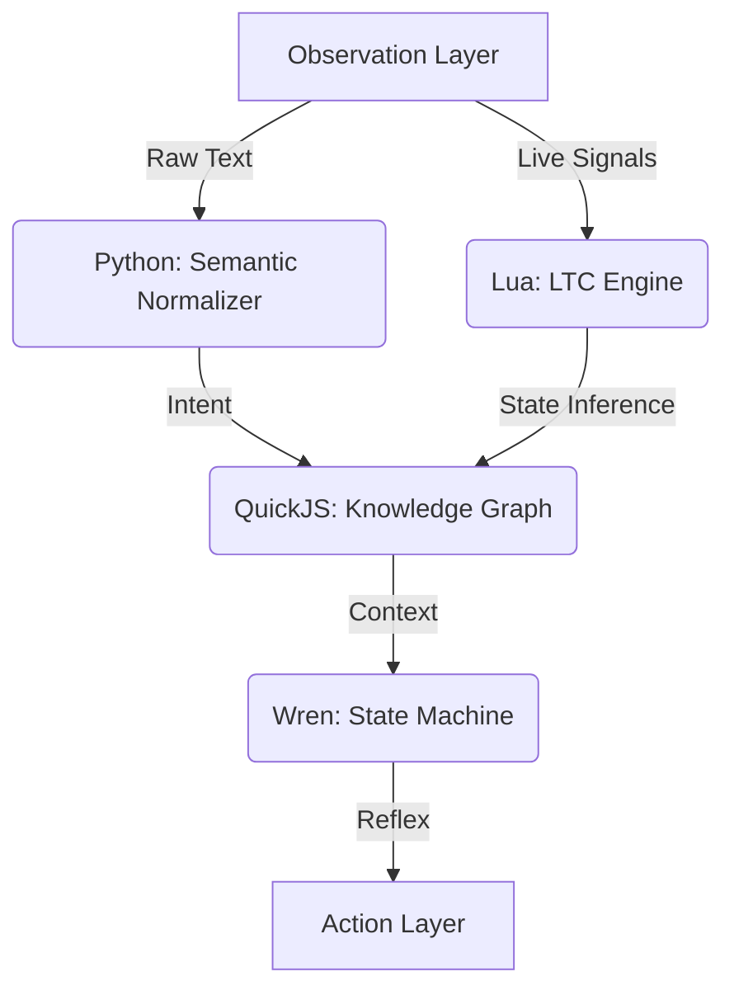

# ARCHITECTURE.md - Project NIA

## System Overview
Project NIA is a distributed logic engine where each component is optimized for a specific phase of the O.D.A. cycle.

## Component Breakdown

### 1. Linguistic Tokenizer (Python)
- **Location**: `/bridge/normalizer.py`
- **Role**: Normalizes user input and external data into a canonical semantic form.

### 2. LTC Engine (Lua)
- **Location**: `/core/logic_lua/ltc_engine.lua`
- **Role**: Continuous-time state inference, handling signals that vary over time.

### 3. Knowledge Graph (QuickJS)
- **Location**: `/core/graph_js/knowledge_graph.js`
- **Role**: Storing relationships and facts in a zero-weight directed graph.

### 4. Reflex Cache (Wren)
- **Location**: `/core/state_wren/reflex_cache.wren`
- **Role**: High-speed behavioral response and state management.

## Integration Bridge
The components communicate via a native C bridge (`/bridge`) that passes messages between the respective virtual machines (VMs).
